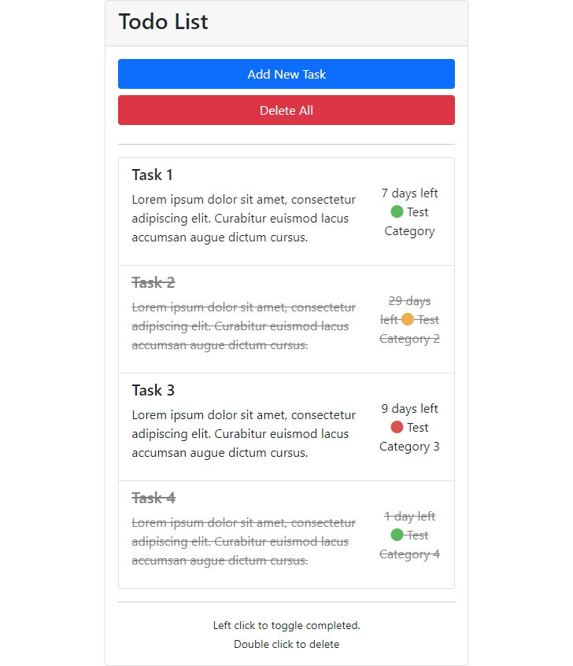

# Inveon Full Stack Bootcamp - Homework 1 - ToDo APP

## Proje Hakkında

Vanilla Javascript ile yapılan bir todo uygulamasıdır.

### Fonksiyonlar
* Tek tıklama ile yazılan todo tamamlanabilir.
* Çift tıklama ile todo silinebilir.
* Todo eklenirken önemlilik derecesi belirlenebilir.
* Tarih seçimi sonucu kaç gün kaldığı gösterilebilir.
* Ek açıklama belirtilebilir.
* Bütün todolar silinebilir

### Kullanılan Teknolojiler

* HTML
* CSS
* JavaScript
* [Bootstrap](https://getbootstrap.com)

## Linkler

Proje Linki: [https://github.com/burakcanaygun/inveon-bootcamp-projects](https://github.com/burakcanaygun/inveon-bootcamp-projects)
