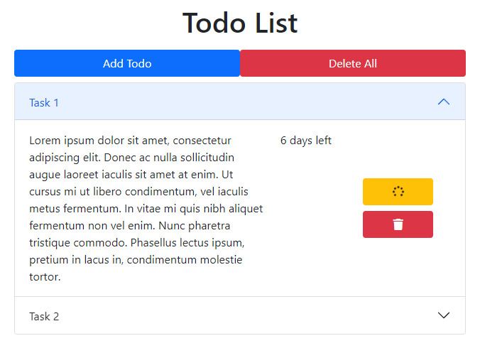

# Inveon Full Stack Bootcamp - Homework 2 - React Todo

## About the Project

A todo application written with frontend in React and backend in Express.

### Technologies Used

* [React](https://reactjs.org/)
* [Redux](https://redux.js.org/)
* [React Bootstrap](https://react-bootstrap.github.io/)
* [Bootstrap](https://getbootstrap.com/)
* [UUID](https://www.npmjs.com/package/uuid)
* [Axios](https://www.npmjs.com/package/axios)
* [ExpressJS](http://expressjs.com/)
* [Nodemon](https://www.npmjs.com/package/nodemon)

<hr>



## To run at local

First you need to clone the repository.

```
git clone https://github.com/135-Inveon-FullStack-Bootcamp-Classroom/BurakcanAygun_HomeWorks.git
```

### For Frontend

After cloning, you need to install the dependencies and run start script. If you use npm, you can use the
following command.

```
npm install
npm start
```

If you use yarn, you can use the following command.

```
yarn install
yarn start
```

### For Backend

After cloning, you need to install the dependencies. If you use npm, you can use the following command.

```
npm install
npm server
```

If you use yarn, you can use the following command.

```
yarn install
yarn server
```

