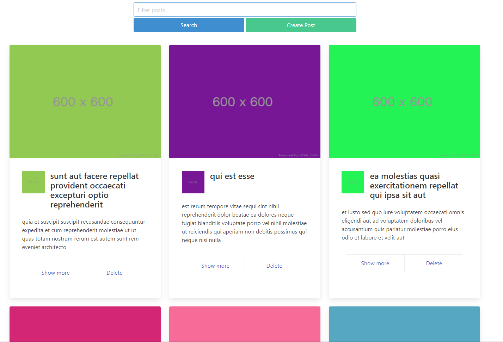

# React JsonPlaceholder



Blog-like application for fetching data from [JsonPlaceholder](https://jsonplaceholder.typicode.com/)
with axios. Using [React](https://reactjs.org/) and [Redux Toolkit](https://redux-toolkit.js.org/). For
live version please [click here](https://immense-meadow-71780.herokuapp.com/).

## About Project

* You can search posts by title. Also you can create new posts or delete post.
* You can show details of a post and create new comments. Also you can delete it.
* Also it's fetch thumbnail image of a post.
* If you don't like the card size, you can change it inside the Post.js

### Technologies Used

* [React](https://reactjs.org/)
* [Redux Toolkit](https://redux-toolkit.js.org/)
* [Bulma](https://bulma.io/)
* [React Bulma Components](https://react-bulma.dev/en)
* [Formik](https://formik.org/)
* [Yup](https://github.com/jquense/yup)
* [Axios](https://www.npmjs.com/package/axios)

### To run at local

First you need to clone the repository.

```git clone https://github.com/135-Inveon-FullStack-Bootcamp-Classroom/BurakcanAygun_HomeWorks.git```

After cloning, you need to install the dependencies and run start script. If you use npm, you can use the
following command.

```
npm install
npm start
```

If you use yarn, you can use the following command.

```
yarn install
yarn start
```

#### Have fun
