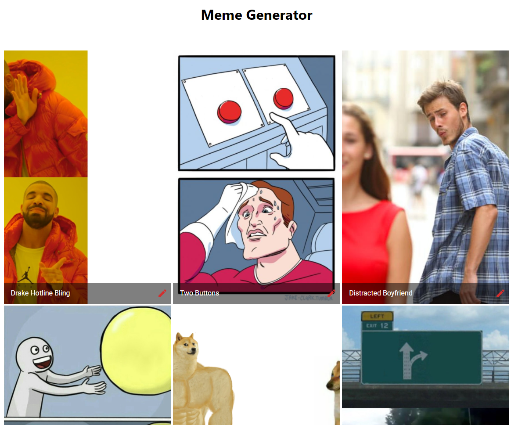

# Meme Generator

## About the Project

A meme generator that uses the [Imgflip API](https://imgflip.com/) to generate memes. For live
demo, [click here](https://powerful-everglades-28384.herokuapp.com/).

### Technologies Used

* [React](https://reactjs.org/)
* [Redux Toolkit](https://redux-toolkit.js.org/)
* [MUI](https://material-ui.com/)
* [Axios](https://www.npmjs.com/package/axios)
* [ExpressJS](http://expressjs.com/)
* [Nodemon](https://www.npmjs.com/package/nodemon)
* [React Router Dom](https://reactrouter.com/)


<hr>




## To run at local

First you need to clone the repository.

``` git clone https://github.com/burakcanaygun/inveon-bootcamp-projects.git ```

### For Frontend

After cloning, you need to install the dependencies and run start script. If you use npm, you can use the
following command.

```
npm install
npm start
```

If you use yarn, you can use the following command.

```
yarn install
yarn start
```

### For Backend

After cloning, you need to install the dependencies. If you use npm, you can use the following command.

```
npm install
npm server
```

If you use yarn, you can use the following command.

```
yarn install
yarn server
```
